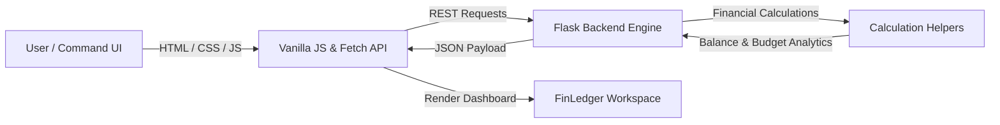

# 💳 FinLedger

> **"Track Money. Understand Spending. Plan Better."**

FinLedger is a modern personal finance and expense management web application designed as a personal financial command center. Users can track income and expenses, manage category budgets, set savings goals, monitor recurring commitments, analyze spending patterns, and generate executive financial reports.

---

## ⚡ Features

- **Financial Command Dashboard:** Dynamic real-time calculation of Available Balance, Total Income, Total Expenses, and Savings Rate.
- **Cash Flow & Expense Analytics:** Monthly cash-flow visualization and expense category breakdown.
- **Transactions Ledger:** Complete transaction system supporting Income and Expense tracking, category filtering, search, payment method classification, and slide-over entry panels.
- **Category Budget Planner:** Monthly category budget limits with healthy, near-limit, and exceeded status indicators.
- **Savings Goals Tracker:** Target-based savings goals with contribution tracking and progress visualization.
- **Recurring Payments & Commitments:** Monitor recurring subscriptions, utility bills, and scheduled upcoming payments.
- **Command Quick Actions:** Keyboard-friendly modal interface for rapid financial entry.
- **Executive Reports & Printing:** Print-friendly executive summary reports.

---

## 🛠️ Tech Stack

- **Frontend:** HTML5, CSS3 (Custom Financial Command UI), Vanilla JavaScript (ES6+), Fetch API
- **Backend:** Python 3 (Flask)

---

## 🏗️ Architecture



---

## 📁 Project Structure

```
finledger/
├── app.py              # Flask backend REST API & calculation engine
├── requirements.txt    # Python dependencies (Flask)
├── README.md           # Project documentation
├── .gitignore          # Git exclusion rules
├── templates/          # HTML Page Templates (index, transactions, budgets, goals, analytics, reports)
└── static/             # Static Assets
    ├── css/style.css   # Premium Financial Visual Identity
    └── js/app.js       # Client Engine & Rendering Logic
```

---

## 🚀 How to Run

1. **Install Dependencies:**
   ```bash
   python -m pip install -r requirements.txt
   ```

2. **Start Server:**
   ```bash
   python app.py
   ```

3. **Access Application:** Open `http://127.0.0.1:5000` in your web browser.

---

## 🔌 REST APIs Summary

- `GET /api/dashboard` — Calculate financial metrics & overview
- `GET /api/transactions` — Query, search, and filter transactions
- `POST /api/transactions` — Record new transaction
- `PATCH /api/transactions/<id>` — Update transaction details
- `DELETE /api/transactions/<id>` — Delete transaction
- `GET /api/budgets` — Query monthly category budget usage
- `POST /api/budgets` — Create new budget limit
- `GET /api/goals` — Query savings goals & progress
- `POST /api/goals/<id>/contribute` — Add contribution to goal
- `GET /api/recurring` — List recurring payments
- `GET /api/analytics` — Executive category & payment method breakdown
- `GET /api/search` — Search across transactions, budgets, and goals
- `GET /api/reports` — Generate printable executive report payload

---

## 📊 Complexity Analysis

| Operation | Time Complexity | Space Complexity | Description |
| :--- | :--- | :--- | :--- |
| ID Lookup | $O(1)$ average | $O(1)$ | Hash dictionary lookup |
| Transaction Search & Filter | $O(n)$ | $O(n)$ | Linear scan over stored records |
| Category Aggregation | $O(n)$ | $O(k)$ | Aggregation over $k$ categories |
| Dashboard Calculation | $O(n)$ | $O(1)$ | Dynamic metric calculations |
